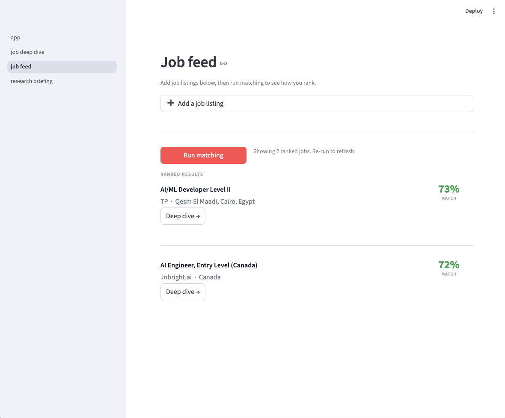
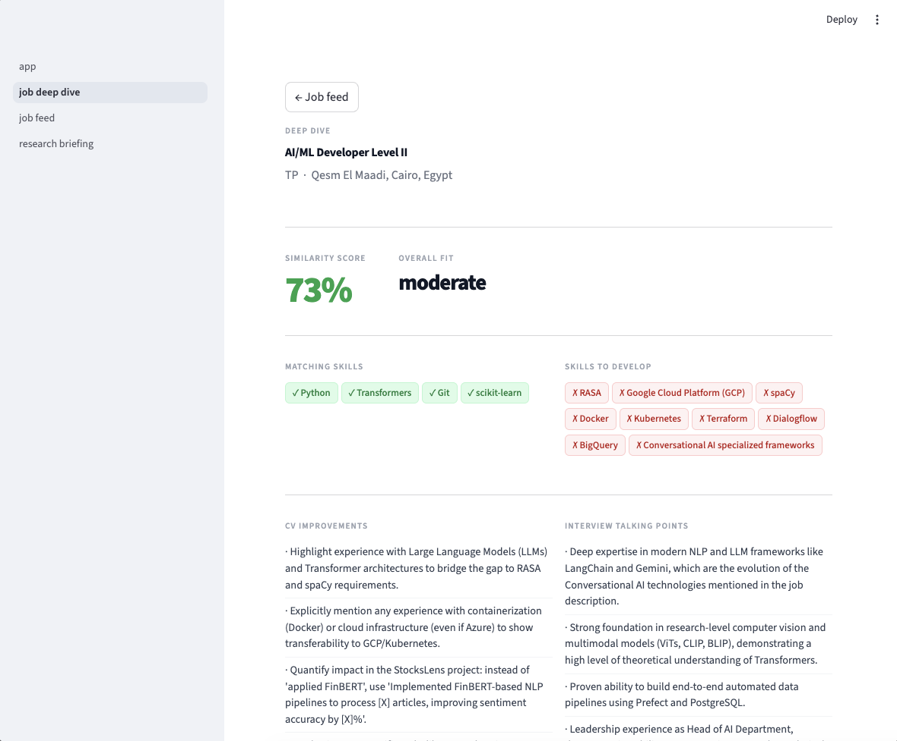
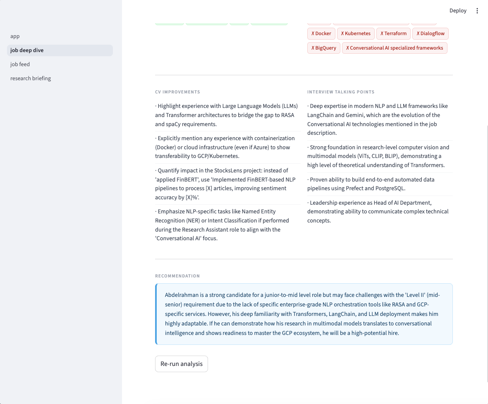
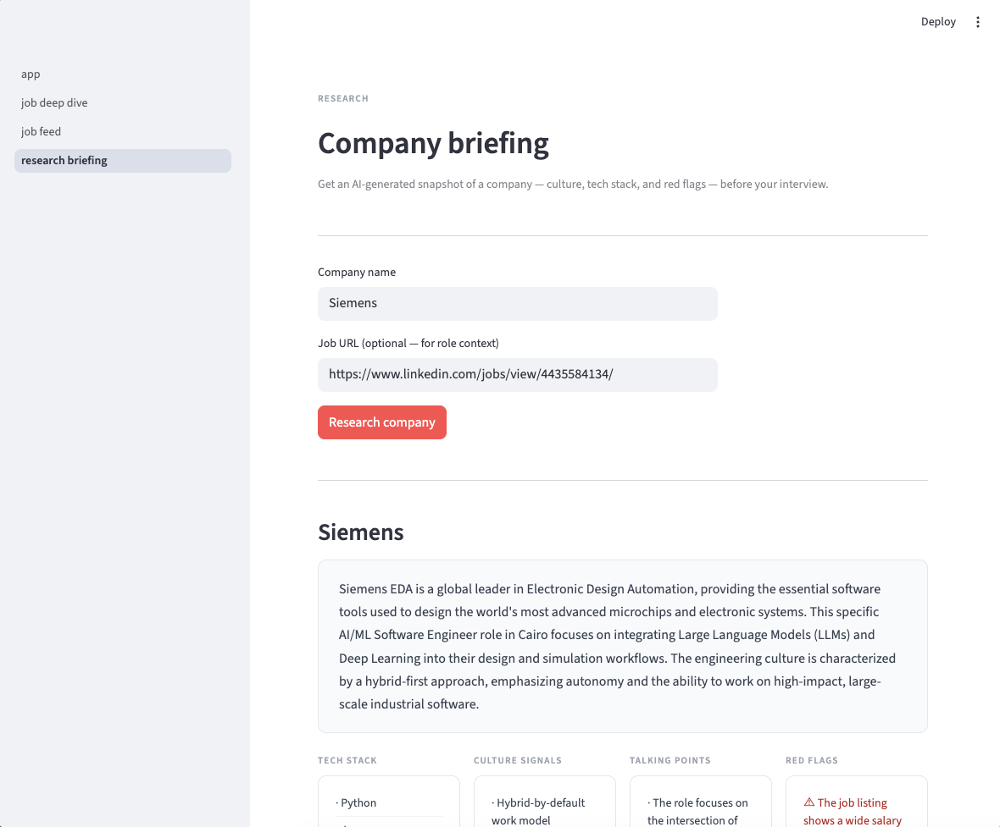
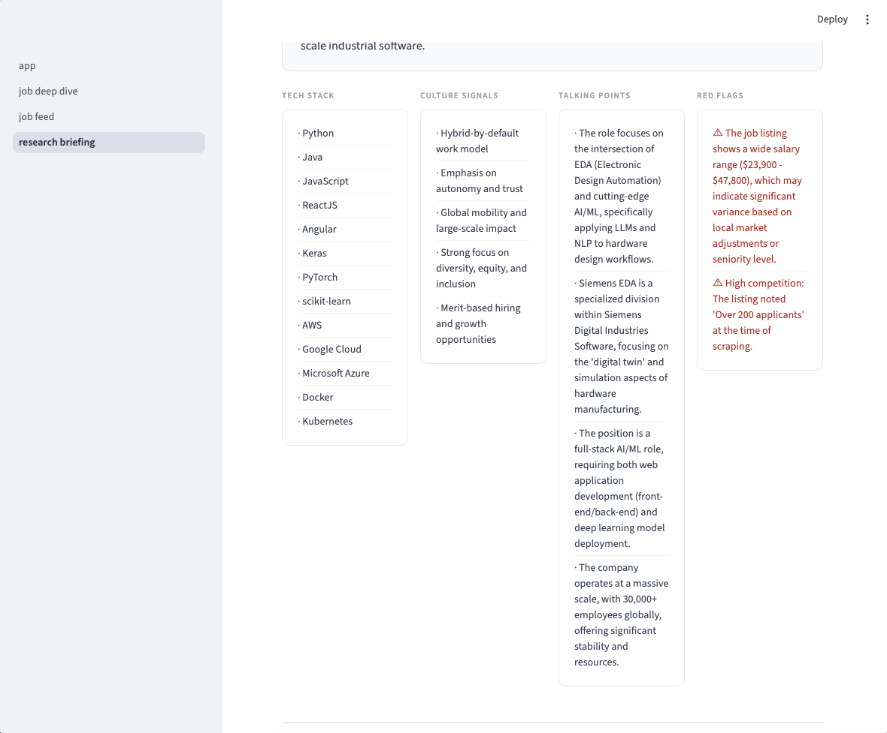

# CVAligneer 🎯

An end-to-end AI engineering system that matches your CV to jobs semantically, identifies exact skill gaps, and autonomously researches target companies using a multi-tool LangGraph agent.

Built as a real portfolio project — not a tutorial clone.

---

## Demo
 
### Job Feed — Semantic Matching

 
### Deep Dive — Gap Analysis


 
### Research Briefing — Autonomous Agent Output



---

## What it does
 
Most job search tools match keywords. CVAligneer matches meaning.
 
| Feature | How it works |
|---|---|
| **CV Parsing** | PyMuPDF extracts text → LLM structures it into a typed profile |
| **GitHub Analysis** | Pulls your repos + READMEs → LLM infers skills and domains |
| **Job Ingestion** | Paste any job URL → scraper + LLM extracts structured listing |
| **Semantic Matching** | Candidate and job embeddings compared via pgvector cosine similarity |
| **Gap Analysis** | LLM identifies missing skills and rewrites CV bullets for each job |
| **Research Agent** | LangGraph ReAct agent autonomously searches, scrapes, and synthesises company intelligence |
 
---

## Tech stack
 
| Layer | Technology |
|---|---|
| LLM (local) | Ollama — llama3.1:8b |
| LLM (cloud) | OpenAI GPT-4o-mini |
| Embeddings (local) | nomic-embed-text via Ollama |
| Embeddings (cloud) | text-embedding-3-small |
| Agent framework | LangGraph |
| Vector database | Supabase + pgvector |
| PDF parsing | PyMuPDF |
| Web scraping | httpx + BeautifulSoup |
| Search | Self-hosted OpenSERP |
| Backend | FastAPI (async) |
| Frontend | Streamlit |
| Data validation | Pydantic v2 |
 
LLM provider is configurable — switch between Ollama and OpenAI with one environment variable.
 
---

## Setup
 
### Prerequisites
- Python 3.11+
- [Ollama](https://ollama.ai) running locally (or OpenAI API key)
- Supabase project
- GitHub personal access token
### 1. Clone and install
 
```bash
git clone https://github.com/yourusername/cvaligneer.git
cd cvaligneer
python -m venv venv
source venv/bin/activate  # Windows: venv\Scripts\activate
pip install -r requirements.txt
```
 
### 2. Configure environment
 
```bash
cp .env.example .env
```
 
Edit `.env` with your keys:
 
```bash
# Choose your LLM provider
LLM_PROVIDER=ollama          # or "openai"
 
# Ollama (if running locally)
OLLAMA_BASE_URL=http://localhost:11434/v1
OLLAMA_CHAT_MODEL=llama3.1:8b
OLLAMA_EMBEDDING_MODEL=nomic-embed-text
 
# OpenAI (if using cloud)
OPENAI_API_KEY=sk-...
 
# Supabase
SUPABASE_URL=https://your-project.supabase.co
SUPABASE_KEY=your-anon-key
DATABASE_URL=postgresql://...
 
# GitHub
GITHUB_TOKEN=ghp_...
 
# OpenSERP (self-hosted) or remove if not using research agent
OPEN_SERP_URL=http://your-server:7000
```
 
### 3. Set up the database
 
In your Supabase SQL editor, run:
 
```sql
create extension if not exists vector;
 
create table candidate_profiles (
    id uuid primary key default gen_random_uuid(),
    full_name text unique not null,
    profile_json jsonb not null,
    github_analysis jsonb,
    embedding vector(768),
    created_at timestamptz default now()
);
 
create table job_listings (
    id uuid primary key default gen_random_uuid(),
    url text unique not null,
    source text,
    title text,
    company text,
    location text,
    job_json jsonb not null,
    embedding vector(768),
    saved_at timestamptz default now()
);
```
 
### 4. Pull Ollama models (if using local LLM)
 
```bash
ollama pull llama3.1:8b
ollama pull nomic-embed-text
```
 
### 5. Run the dashboard
 
```bash
streamlit run dashboard/app.py
```
 
---

## Usage
 
**Step 1 — Upload your CV**
Open the sidebar, upload your PDF, and optionally enter your GitHub username. Click "Parse Profile" — your CV is parsed, GitHub is analysed, and everything is embedded and saved.
 
**Step 2 — Add jobs**
Paste any job URL (Greenhouse, Lever, Workday, Indeed, company career pages) into the sidebar and click "Save Job". The system scrapes the page and extracts structured data automatically. LinkedIn job URLs require login so are not supported.
 
**Step 3 — Browse your Job Feed**
The Job Feed page ranks all saved jobs by semantic similarity to your profile. Each card shows your match score and a "Deep Dive" button.
 
**Step 4 — Run Gap Analysis**
Click "Deep Dive" on any job to see exactly which skills match, which are missing, specific CV bullet rewrites, and talking points for your cover letter.
 
**Step 5 — Research a company**
On the Research Briefing page, enter a company name and job URL. The LangGraph agent autonomously searches the web, scrapes company pages, finds engineers on LinkedIn, and returns a structured intelligence briefing.
 
---
 
## Project structure
 
```
cvaligneer/
├── core/
│   ├── models.py          # Pydantic data models
│   ├── config.py          # Centralised settings (Pydantic Settings)
│   ├── llm.py             # OpenAI / Ollama abstraction layer
│   ├── embeddings.py      # Text → vector conversion
│   └── database.py        # Supabase + pgvector operations
├── ingestion/
│   ├── cv_parser.py       # PDF → CandidateProfile
│   ├── github_analyzer.py # GitHub repos → developer summary
│   └── job_ingestor.py    # URL → JobListing + local store
├── matching/
│   ├── ranker.py          # pgvector cosine similarity ranking
│   └── gap_analyzer.py    # LLM-powered skill gap analysis
├── agent/
│   ├── graph.py           # LangGraph ReAct agent
│   └── tools/
│       ├── search.py      # Web search via OpenSERP
│       ├── web_scraper.py # HTML extraction
│       └── linkedin_search.py  # LinkedIn indexed search
├── dashboard/
│   ├── app.py             # Entry point + sidebar
│   ├── state.py           # Session state management
│   └── pages/
│       ├── job_feed.py         # Ranked job matches
│       ├── job_deep_dive.py    # Gap analysis view
│       └── research_briefing.py # Agent output view
└── scripts/
    └── setup_db.py        # DB connection verification
```
 
---
 
## Known limitations
 
- LinkedIn job listing pages require authentication — paste the job URL from Greenhouse, Lever, or Workday instead
- The research agent works best with larger models (llama3.1:70b or GPT-4o). llama3.1:8b may occasionally produce malformed JSON on complex research tasks
- Embedding dimensions are set to 768 (nomic-embed-text). Switching to OpenAI embeddings (1536 dims) requires re-creating the pgvector tables
---